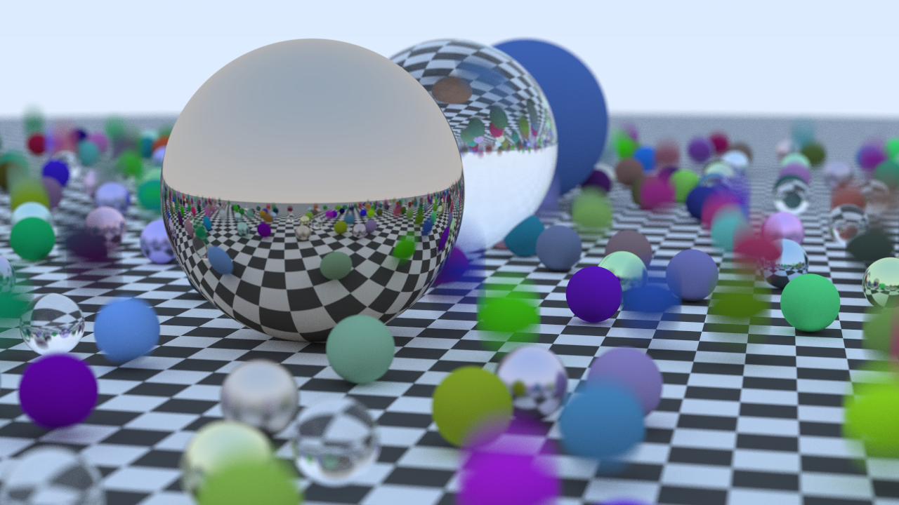

# Ray Tracing

---

## Impilmented Topics
 - Objects:  
   - Sphere
 - Materials:  
   - Diffuse (lambertain)
   - Metal
   - Dielectrics
   - Textures
 - Camera
   - Orientation
   - Defocus blur (depth of field)
   - Motion Blur
 - Optimization
   - Bounding Volume Hierarchy (BVH)
   - Multithreading

 
## Output
Output is in .ppm format. Right now, to get an output image, run build. The exe will output `image.ppm`.  
To change the quality of the image, change `samples_per_pixel` or `image_width`.
  
It is intresting to note that glass spheres do not cast shadows. This is physically correct.

### To-Do
 - ***Perlin***
 - Rectangles
 - Lights
 - Volumes  

----------

